# Kibit
Kivy - Git Backup Tool

## TO DO
First of all, create a private Git repository, make sure you have the required local permissions, and set the necessary configurations.

## Walkthrough
When the application starts, you will be welcomed by the list view.

### Starting
**List View** : In this screen, the created items are listed.

>If this is your first time opening the application, you should open the Options view by clicking the button at the top that says 'Options'.

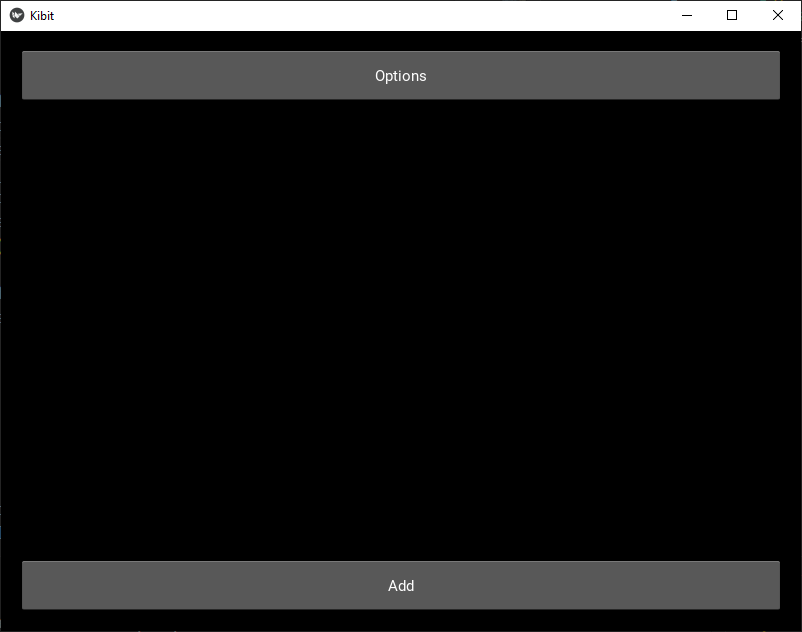

**Options View** : In this screen, first-time users should set their private repository by entering it in the text area and clicking the 'Save' button.

Also, if needed, there is a relative path view available where you can set some paths to be dynamic. By simply clicking the 'Relative Paths' button, you can change the view.
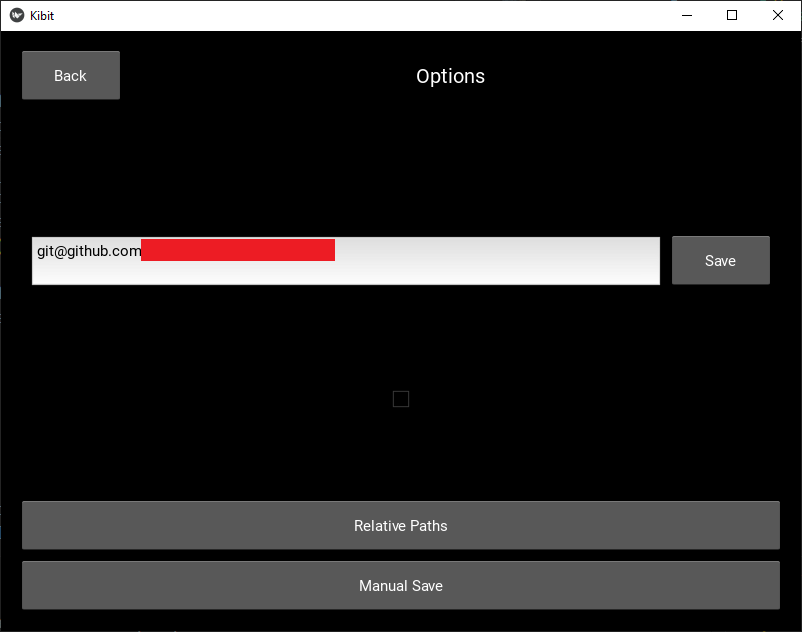

**Relative Paths View** : In this screen, you can set an unlimited number of dynamic paths that will change the folder paths to your liking.

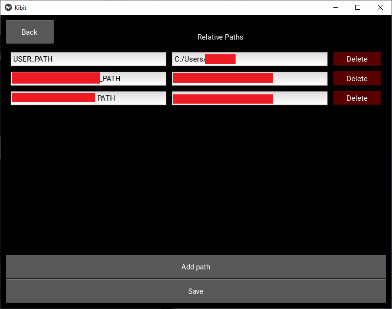

### Adding Items
In the list view, there is an 'Add' button at the bottom of the application. When it is clicked, the view will change to the 'Add View'.

**Add View** : 
In this view, you should give a name to your new item. After that, if 'Add Path' is clicked, a new path input will be added to your item.

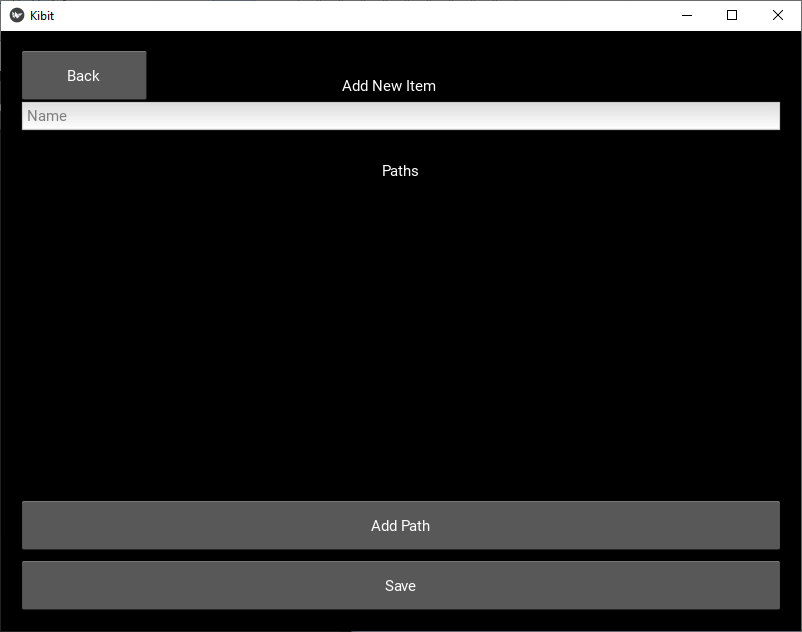

**Add View - Add Path** : In path input, you can manually insert your path for the item or you can click the button 'Select' for the directory selection tool.

**Add View - Added Path** : After adding the path, You can click the button "Save" to finalize the adding item process. Then you will be redirected to list view.

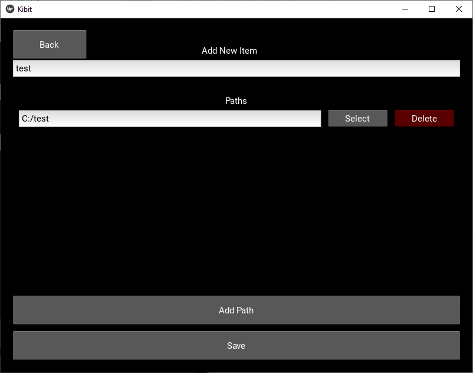

**List View with Item** : There you can see your new item. If you want to change anything about your item, you can do that in the detail view, by using the 'Detail' button next to item.

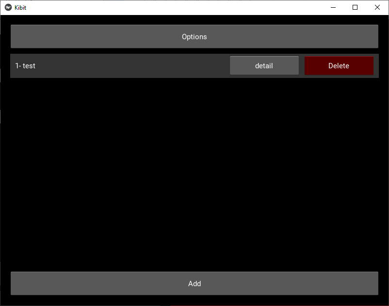

**Detail View** : In detail view, you can see that there is a new button next to our added paths which is called 'History'. In history view you can see the information about the previous commits to your adjusted git repository. In detail view, you can add new paths, change existing paths, delete paths or change the name of the item.

Since there is no commit action triggered, the history view will be empty, So, to do that, you can go the 'List View' -> 'Options View' and there will be a button at the bottom of the view, says 'Manual Save'.

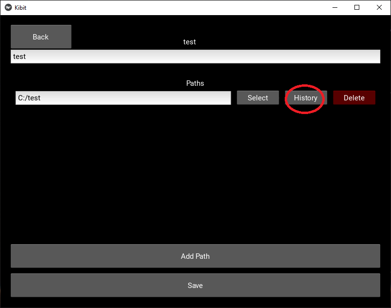

**Manual Save View** : In this view, you can click the button 'Save' to trigger the commit action from local items to remote git repository.

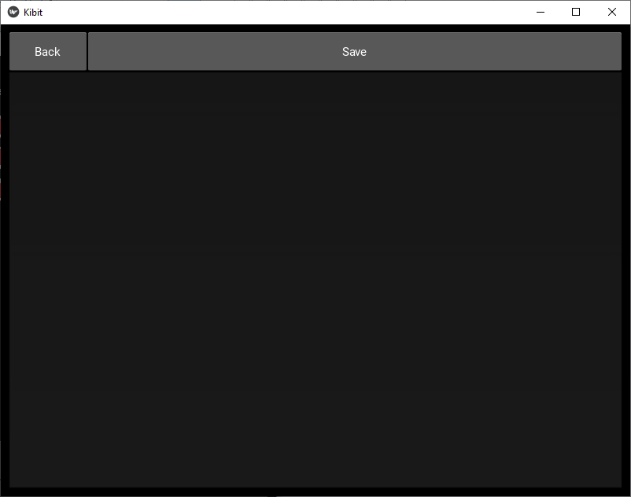

**Manual Save View 2** : 
As a result, you can see the logs of the action appear in the text area below the buttons in this view.

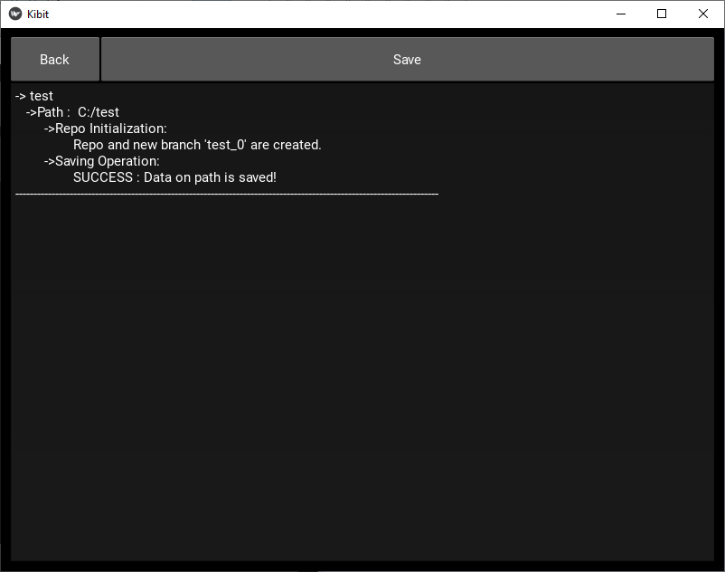

**Github** : Then, you can check to see if the save you committed is actually in your private repository.

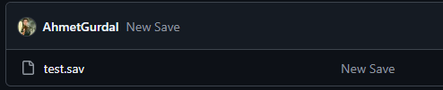

**History View** : Lastly you can check the last commits in the history view as well.

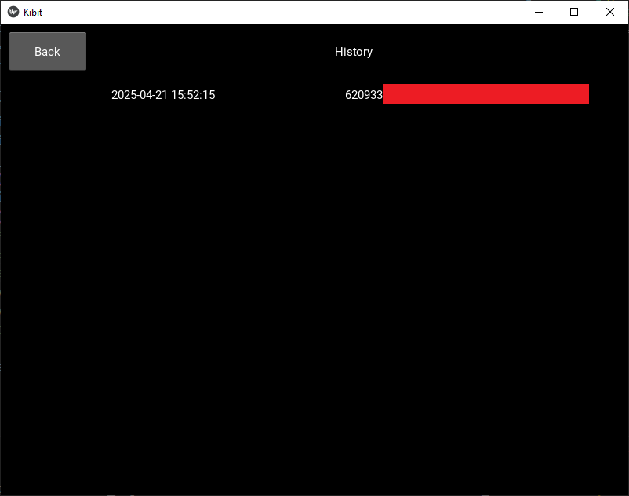